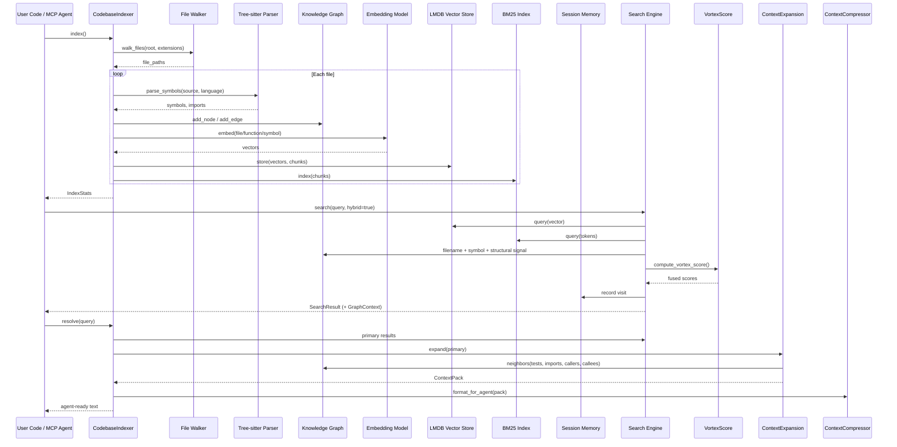
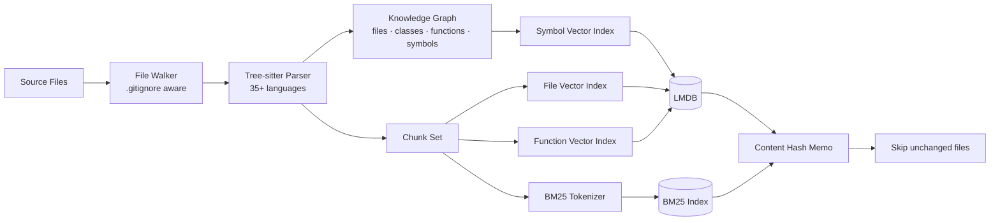
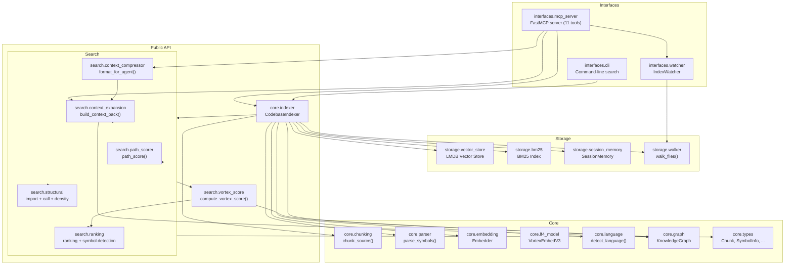

<div align="center">

# vortexa &nbsp; 🧠

**V2 Context Engine — agent-first code retrieval**

_Knowledge graph · hybrid search · context expansion · MCP server · AST-aware chunking_

[](LICENSE)
[](#)
[](https://pypi.org/project/vortexa/)
[](https://pypi.org/project/vortexa/)

</div>

---

## Table of Contents

- [Overview](#overview)
- [Features](#features)
- [Quick Start](#quick-start)
- [Python API](#python-api)
  - [Indexing](#indexing)
  - [Searching](#searching)
  - [Knowledge Graph & Context Expansion](#knowledge-graph--context-expansion)
  - [Watch Mode](#watch-mode)
  - [Management](#management)
- [CLI Search](#cli-search)
- [MCP Server](#mcp-server)
  - [Tools](#tools)
  - [Usage with Claude Code / Cursor](#usage-with-claude-code--cursor)
- [Architecture](#architecture)
- [Dependencies](#dependencies)
- [License](#license)

---

<div align="center">

## Overview

</div>

vortexa is an agent-first **codebase context engine** that combines dense retrieval, sparse retrieval, and a structural knowledge graph into a single persistent index. It is designed for AI agents and developers who want to **ask the codebase questions**, not just grep it.

On top of a hybrid dense + BM25 index, vortexa builds:

- a **knowledge graph** of files, classes, functions, methods, and symbols with import / call / containment edges;
- a **multi-level vector index** at file, function, and symbol granularity;
- **context expansion** that pulls in tests, importers, callers, callees, and sibling modules;
- a learned-style **vortex score** that fuses semantic similarity, BM25, filename signals, graph signals, and structural importance;
- a **session memory** that tracks agent queries and visited symbols across MCP turns.

The result: a single MCP call can hand an agent a complete `ContextPack` — primary results plus the related code an LLM needs to actually answer the question — rather than a flat list of file:line hits.

```python
results = indexer.search("authentication middleware that validates JWT tokens", top_k=5)
# → Finds the right files even if they use "auth", "verify", "token" instead of "authentication"

pack = indexer.resolve("where is JWT validation implemented?", top_k=5)
# → Primary results + tests + importers + callees + graph expansion, formatted for an agent
```

vortexa can run as a **standalone Python library**, be embedded into any agent, or serve as an **MCP server** for LLM tools.

---

<div align="center">

## Features

</div>

<table>
<tr>
<td><strong>Semantic search</strong></td>
<td>Find code by describing what it does in natural language — no exact-string matching needed.</td>
</tr>
<tr>
<td><strong>Hybrid retrieval</strong></td>
<td>Combines dense embeddings (semantic meaning) with BM25 (keyword precision) using adaptive alpha weighting.</td>
</tr>
<tr>
<td><strong>Knowledge graph</strong></td>
<td>Per-repo graph of files, classes, functions, methods, and symbols with import / call / containment edges. Traverse, query by seed, or compute shortest paths.</td>
</tr>
<tr>
<td><strong>Context expansion</strong></td>
<td>Given primary results, automatically expands to include tests, importers, callers, callees, and sibling modules — packaged as a structured <code>ContextPack</code>.</td>
</tr>
<tr>
<td><strong>Vortex score</strong></td>
<td>Weighted fusion of semantic similarity, BM25, filename / path signal, symbol signal, graph proximity, import signal, and structural importance.</td>
</tr>
<tr>
<td><strong>Multi-level indexing</strong></td>
<td>Three separate vector indexes — file, function, symbol — for granular lookup. Each index has its own metadata.</td>
</tr>
<tr>
<td><strong>AST-aware chunking</strong></td>
<td>Splits source code at function/class/block boundaries using tree-sitter when available, falls back to line-based splitting. Supports 35+ languages.</td>
</tr>
<tr>
<td><strong>Incremental indexing</strong></td>
<td>Content-hash memoization means only changed files are re-indexed. Full re-index avoids redundant embedding computations.</td>
</tr>
<tr>
<td><strong>Persistent storage</strong></td>
<td>LMDB-backed vector store survives restarts. Embedding cache avoids recomputing identical content.</td>
</tr>
<tr>
<td><strong>Session memory</strong></td>
<td>Tracks agent queries, visited symbols, and recent result files across MCP turns to boost recall of recently-touched code.</td>
</tr>
<tr>
<td><strong>Live watch mode</strong></td>
<td>Background thread (native inotify/FSEvents via <code>watchfiles</code>, or polling fallback) auto-re-indexes with configurable debounce.</td>
</tr>
<tr>
<td><strong>MCP server</strong></td>
<td>11 tools across search, graph, and lifecycle — pluggable into Claude Code, Cursor, and any MCP-compatible agent.</td>
</tr>
<tr>
<td><strong>Zero mandatory heavy deps</strong></td>
<td>Core requires only <code>numpy</code>, <code>lmdb</code>, <code>bm25s</code>, <code>pathspec</code>, and the default LF4 embedding model. Model2Vec and tree-sitter are optional extras.</td>
</tr>
</table>

---

<div align="center">

## Quick Start

</div>

### Installation

```bash
# Core (BM25 + LF4 embeddings + line-based chunking)
pip install vortexa

# Full (Model2Vec embeddings + tree-sitter AST chunking)
pip install "vortexa[full]"

# With MCP server support
pip install "vortexa[mcp]"

# Everything
pip install "vortexa[full,mcp]"
```

### Index a codebase

```python
from vortexa.core.indexer import CodebaseIndexer

indexer = CodebaseIndexer(root=".")
stats = indexer.index()

print(f"Indexed {stats.indexed_files} files, {stats.total_chunks} chunks")
print(f"Graph: {indexer.graph.node_count} nodes, {indexer.graph.edge_count} edges")
print(f"Languages detected: {stats.languages}")
print(f"Index time: {stats.index_time_ms:.0f} ms")
```

### Search with natural language

```python
results = indexer.search("CSV parser implementation", top_k=5)

for r in results:
    print(f"{r.chunk.file_path}:{r.chunk.start_line}  score={r.score:.3f}")
    print(f"  {r.chunk.content[:150].strip()}")
    print()
```

Output:
```
src/parsers/csv_parser.py:42  score=0.892
  def parse_csv(filepath: str, delimiter: str = ",") -> list[dict]:
      """Parse a CSV file into a list of dictionaries."""
      with open(filepath, "r") as f:

tests/test_csv_parser.py:15  score=0.756
  def test_parse_csv_with_header():
      result = parse_csv("test.csv")
      assert len(result) == 3
```

---

<div align="center">

## Python API

</div>

### Indexing

```python
from vortexa.core.indexer import CodebaseIndexer
from vortexa.core.types import ChunkConfig

# Default chunking (aim for 50-line chunks, 5-line overlap)
indexer = CodebaseIndexer(root="/path/to/project")
stats = indexer.index()
# → IndexStats(indexed_files=127, total_chunks=843, languages={"python": 45, ...})

# Custom chunk configuration
indexer = CodebaseIndexer(
    root=".",
    chunk_config=ChunkConfig(chunk_size=100, chunk_overlap=10),
)
stats = indexer.index(force=False, include_text_files=True)

# Force full re-index
stats = indexer.index(force=True)
```

After indexing, `indexer.graph` holds the knowledge graph and `indexer.session` tracks query history.

### Searching

```python
# Hybrid search (auto-weighted semantic + BM25)
results = indexer.search("error handling", top_k=10)

# Pure semantic search
results = indexer.search("database connection pool", top_k=5, alpha=1.0)

# Pure BM25 keyword search
results = indexer.search("parse csv", top_k=5, alpha=0.0)

# Hybrid search with per-file graph context (key symbol + 1 in + 1 out edge)
results = indexer.search("auth middleware", top_k=5, hybrid=True)

# Symbol lookup (find definitions by name)
results = indexer.find_symbol("ConnectionPool", top_k=5)

# Related chunks (find chunks similar to a given chunk index)
results = indexer.find_related(chunk_idx=3, top_k=5)
```

Each result is a `SearchResult` (or `SearchResultWithContext` when `hybrid=True`):

| Field | Type | Description |
|-------|------|-------------|
| `chunk.file_path` | `str` | Relative file path |
| `chunk.start_line` | `int` | Start line number |
| `chunk.end_line` | `int` | End line number |
| `chunk.content` | `str` | Code snippet (up to 500 chars) |
| `chunk.language` | `str` | Detected programming language |
| `chunk.lineage` | `Lineage` | Source path + byte offsets |
| `chunk.chunk_hash` | `str` | Content hash for memoization |
| `score` | `float` | Final vortex score (0–1) |
| `source` | `str` | `"semantic"`, `"bm25"`, or `"hybrid"` |
| `context` | `GraphContext?` | Present when `hybrid=True`; key symbol + 1 incoming + 1 outgoing edge |

### Knowledge Graph & Context Expansion

Vortexa indexes every file, class, function, method, and symbol into an in-memory knowledge graph and persists it next to the chunks. You can traverse it directly or use the high-level helpers:

```python
# Inspect the graph
print(indexer.graph.node_count, "nodes,", indexer.graph.edge_count, "edges")

# Find a node by name
nodes = indexer.graph.find_nodes_by_name("JWTValidator")
for n in nodes:
    print(n.id, n.kind, n.file_path)

# Neighbors and shortest path
neighbors = indexer.graph.neighbors("file:src/auth/jwt.py", direction="out")
path = indexer.graph.shortest_path("file:src/auth/jwt.py", "file:src/api/users.py")

# Most-connected architectural hubs
hubs = indexer.graph.pick_seeds(top_k=10)
```

For agent-style retrieval, use `resolve` to get a fully assembled `ContextPack`:

```python
pack = indexer.resolve("how are JWT tokens validated?", top_k=5)
# pack.primary       — top-scoring chunks
# pack.tests         — test files for the primary results
# pack.imports       — modules imported by primary results
# pack.importers     — modules that import the primary results
# pack.callers       — callers of the primary symbols
# pack.callees       — callees of the primary symbols
# pack.related       — sibling symbols/files
# pack.context       — formatted, token-budgeted text ready for an LLM prompt
```

The MCP `resolve` tool returns the same `ContextPack` as JSON, and the MCP `search` tool can attach per-file `graph_context` to each result via `hybrid=true`.

### Watch Mode

```python
from vortexa.interfaces.watcher import IndexWatcher

watcher = IndexWatcher(indexer, poll_interval=3.0)
watcher.start()   # Background thread; auto-re-indexes when files change
# ... files change on disk, auto-re-index happens ...
watcher.stop()
```

The watcher prefers `watchfiles` (native inotify/FSEvents/ReadDirectoryChangesW) and falls back to `(mtime_ns, size)` polling if it is unavailable. Set `force_polling=True` to always use polling, or set `VORTEXA_FORCE_POLLING=1` in the environment.

### Management

```python
# Index statistics (includes graph + session info)
stats = indexer.stats()
# → {indexed_files, total_chunks, languages, memo_hits, memo_misses, graph nodes/edges, ...}

# Reset
indexer.clear()   # Delete the persistent index + graph + session
```

---

<div align="center">

## CLI Search

</div>

The installed `vortexa` command can also search a codebase directly:

```bash
# Search the current working directory
vortexa -q "authentication middleware that validates JWT tokens"

# Search a specific codebase root
vortexa -q "CSV parser implementation" /path/to/project

# Pass Kilo-style environment details; `Working directory` is used as the root
vortexa -q "error handling" "Working directory: /path/to/project
Workspace root folder: /"
```

Useful flags:

| Flag | Description |
|------|-------------|
| `-q`, `--query` | Search query. Quote multi-word queries. |
| `--root` | Codebase root to index and search. Overrides `environment_details`. |
| `--top-k` | Maximum number of results to return. Default: `10`. |
| `--alpha` | Semantic weight from `0.0` to `1.0`; defaults to adaptive weighting. |
| `--include-text` | Include text files such as `.md`, `.json`, and `.yaml` in the index. |
| `--force` | Force a full re-index before searching. |
| `--no-index` | Search the existing index only. |
| `--plain` | Print human-readable results instead of JSON. |

By default CLI output is JSON:

```json
[
  {
    "file": "src/auth/middleware.py",
    "lines": "12-48",
    "score": 0.892,
    "source": "hybrid",
    "content": "def validate_jwt(token: str) -> User: ..."
  }
]
```

The `vortexa` command still starts the MCP server when no query is provided. You can also start the server explicitly:

```bash
vortexa serve
# or
vortexa-serve
```

---

<div align="center">

## MCP Server

</div>

vortexa ships with a built-in **MCP (Model Context Protocol) server** that exposes the entire V2 context engine as a set of agent-friendly tools. Start it with:

```bash
# Auto-indexes current directory, serves on stdio
python -m vortexa.interfaces.mcp_server

# Or via the installed entry point
vortexa serve
```

On startup it indexes the current working directory and prints stats to stderr:
```
[vortexa] Indexing /path/to/project ...
[vortexa] Ready: 127 files, 843 chunks, 2104 graph nodes in 1820ms
[vortexa] Auto-reindex watcher started (backend=native)
```

### Tools

The server exposes **11 tools** across three groups.

**Core search & context (3):**

| Tool | Description | Key arguments |
|------|-------------|---------------|
| `search` | Hybrid semantic + BM25 search. Pass `hybrid=true` to enrich each result with per-file graph context. | `query` (str), `top_k` (int, default 10), `hybrid` (bool) |
| `resolve` | Full context assembly — primary results + tests + importers + callers + callees + compressed text. | `query` (str), `top_k` (int, default 5) |
| `explain` | Deep-dive into a specific file path, line number, or symbol name; returns surrounding context and graph neighbors. | `location` (str) |

**Knowledge graph (5):**

| Tool | Description | Key arguments |
|------|-------------|---------------|
| `query_graph` | BFS or DFS traversal from query-relevant seeds. | `query` (str), `mode` (`"bfs"` or `"dfs"`), `max_hops` (int) |
| `get_god_nodes` | Most-connected real entities (architectural hubs). | `top_k` (int, default 10) |
| `get_graph_node` | Detailed info for one node (label, kind, degree, source file). | `label` (str) |
| `get_graph_neighbors` | Incoming and outgoing edges of a node. | `label` (str) |
| `get_shortest_path` | BFS shortest path between two symbols/files. | `source` (str), `target` (str), `max_hops` (int, default 8) |

**Lifecycle (3):**

| Tool | Description | Key arguments |
|------|-------------|---------------|
| `stats` | Index + graph + session statistics. | _(none)_ |
| `watch` | Start/stop the auto-reindex watcher. | `action` (`"start"` or `"stop"`) |
| `clear_index` | Drop the persistent index for the project root. | _(none)_ |

### Usage with Claude Code / Cursor

Add to your MCP configuration file (`~/.cursor/mcp.json` or Claude Code's `mcp_servers` config):

```json
{
  "mcpServers": {
    "vortexa": {
      "command": "python",
      "args": ["-m", "vortexa.interfaces.mcp_server"],
      "cwd": "/path/to/your/project"
    }
  }
}
```

The agent now has access to the full V2 context engine — `search`, `resolve`, and `explain` for retrieval; `query_graph`, `get_god_nodes`, `get_graph_node`, `get_graph_neighbors`, and `get_shortest_path` for navigation; and `stats`, `watch`, `clear_index` for lifecycle. This is significantly more effective than `grep` or `rg` for exploratory queries, because each `search` call can return primary results, related tests, importers, callers, and callees in a single round-trip.

---

<div align="center">

## Architecture

</div>

### Directory Layout

```
vortexa/
├── core/
│   ├── indexer.py       # CodebaseIndexer — main orchestrator
│   ├── chunking.py      # AST-aware (tree-sitter) + line-based chunking
│   ├── parser.py        # Multi-language tree-sitter symbol/import extraction
│   ├── embedding.py     # Embedding models (Model2Vec, SentenceTransformers)
│   ├── lf4_model.py     # Vortex-Embed 4-bit LF4 model (default embedder)
│   ├── language.py      # Language detection & file extension mapping
│   ├── graph.py         # KnowledgeGraph — nodes, edges, traversal, scoring
│   └── types.py         # Shared types (Chunk, ChunkConfig, IndexStats, GraphNode, ...)
├── storage/
│   ├── vector_store.py  # LMDB-backed persistent vector store
│   ├── bm25.py          # BM25 keyword index with persistent storage
│   ├── session_memory.py # Per-session agent query / symbol visit tracking
│   └── walker.py        # File system walker with .gitignore support
├── search/
│   ├── search.py        # Hybrid search orchestrator (dense + sparse)
│   ├── ranking.py       # Result ranking & symbol query detection
│   ├── path_scorer.py   # Filename / path signal scorer
│   ├── vortex_score.py  # Weighted fusion of all ranking signals
│   ├── structural.py    # Import-graph, call-graph, reference-density boosts
│   ├── context_expansion.py  # Pull tests, importers, callers, callees into a ContextPack
│   ├── context_compressor.py # Token-budgeted formatting of a ContextPack
│   └── tokens.py        # Identifier tokenization (camelCase, snake_case)
└── interfaces/
    ├── cli.py           # Command-line search entrypoint
    ├── mcp_server.py    # MCP server with 11 agent tools (stdio transport)
    └── watcher.py       # Live file watcher (watchfiles native + polling fallback)
```

### Data Flow



### Indexing Pipeline



### Module Dependencies



---

<div align="center">

## Dependencies

</div>

| Package | Required | Used For |
|---------|----------|----------|
| `numpy` | Yes | Vector operations, embedding inference |
| `lmdb` | Yes | Persistent vector and chunk metadata storage |
| `bm25s` | Yes | Fast BM25 keyword index and persistence |
| `pathspec` | Yes | `.gitignore` pattern matching in file walker |
| `huggingface-hub` | Yes (default model) | Loading `VTXAI/Vortex-Embed-4.7M` |
| `tokenizers` | Yes (default model) | HF tokenizer for the LF4 embedding model |
| `safetensors` | Yes (default model) | Safe tensor loading for 4-bit weights |
| `model2vec` | Optional | Alternative static embeddings |
| `sentence-transformers` | Optional | Transformer-based dense embeddings |
| `tree-sitter-language-pack` | Optional | AST-aware chunking + multi-language symbol extraction |
| `watchfiles` | Optional | Native FS-event watcher backend |
| `fastmcp` | Optional | MCP server for LLM tool integration |

Install optional groups:

```bash
pip install "vortexa[full]"      # model2vec + sentence-transformers + tree-sitter + watchfiles
pip install "vortexa[full, mcp]" # everything including MCP server
```

---

<div align="center">

## License

</div>

```
Copyright 2025 VortexAI

Licensed under the Apache License, Version 2.0 (the "License");
you may not use this file except in compliance with the License.
You may obtain a copy of the License at

    http://www.apache.org/licenses/LICENSE-2.0

Unless required by applicable law or agreed to in writing, software
distributed under the License is distributed on an "AS IS" BASIS,
WITHOUT WARRANTIES OR CONDITIONS OF ANY KIND, either express or implied.
See the License for the specific language governing permissions and
limitations under the License.
```
