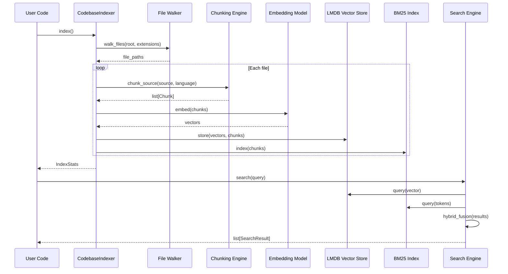
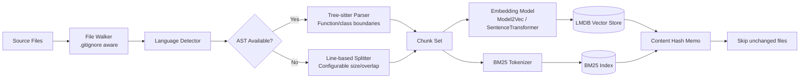
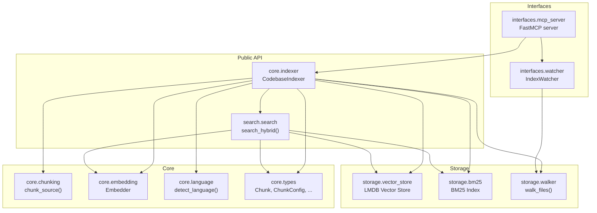

<div align="center">

# vortexa &nbsp; 🧠

**Codebase indexing and semantic search engine**

_Dense + sparse hybrid retrieval · AST-aware chunking · LMDB persistence · MCP server_

[](LICENSE)
[](#)
[](#)

</div>

---

## Table of Contents

- [Overview](#overview)
- [Features](#features)
- [Quick Start](#quick-start)
- [Python API](#python-api)
  - [Indexing](#indexing)
  - [Searching](#searching)
  - [Watch Mode](#watch-mode)
  - [Management](#management)
- [MCP Server](#mcp-server)
  - [Usage with Claude Code / Cursor](#usage-with-claude-code--cursor)
- [Architecture](#architecture)
- [Dependencies](#dependencies)
- [License](#license)

---

<div align="center">

## Overview

</div>

vortexa is a standalone **codebase indexing and semantic search engine** designed for AI agents and developers. It builds a persistent, hybrid search index over source code using:

- **Dense retrieval** via static or learned embeddings (Model2Vec / SentenceTransformers)
- **Sparse retrieval** via BM25 keyword scoring
- **AST-aware chunking** that respects function and class boundaries via tree-sitter
- **LMDB-backed storage** for fast, persistent vector and chunk storage

The result: natural language code search that **understands intent**, not just keywords.

```python
results = indexer.search("authentication middleware that validates JWT tokens", top_k=5)
# → Finds the right files even if they use "auth", "verify", "token" instead of "authentication"
```

vortexa can run as a **standalone Python library**, be embedded into any agent, or serve as an **MCP server** for LLM tools.

---

<div align="center">

## Features

</div>

<table>
<tr>
<td><strong>Semantic search</strong></td>
<td>Find code by describing what it does in natural language — no exact-string matching needed.</td>
</tr>
<tr>
<td><strong>Hybrid retrieval</strong></td>
<td>Combines dense embeddings (semantic meaning) with BM25 (keyword precision) using adaptive alpha weighting.</td>
</tr>
<tr>
<td><strong>AST-aware chunking</strong></td>
<td>Splits source code at function/class/block boundaries using tree-sitter when available, falls back to line-based splitting.</td>
</tr>
<tr>
<td><strong>Incremental indexing</strong></td>
<td>Content-hash memoization means only changed files are re-indexed. Full re-index avoids redundant embedding computations.</td>
</tr>
<tr>
<td><strong>Persistent storage</strong></td>
<td>LMDB-backed vector store survives restarts. Embedding cache avoids recomputing identical content.</td>
</tr>
<tr>
<td><strong>Live watch mode</strong></td>
<td>Background thread polls for file changes and auto-re-indexes with configurable debounce.</td>
</tr>
<tr>
<td><strong>MCP server</strong></td>
<td>Expose as a single <code>search</code> tool for any MCP-compatible agent (Claude Code, Cursor, etc.)</td>
</tr>
<tr>
<td><strong>Zero mandatory heavy deps</strong></td>
<td>Core requires only <code>numpy</code>, <code>lmdb</code>, and <code>pathspec</code>. Model2Vec and tree-sitter are optional extras.</td>
</tr>
</table>

---

<div align="center">

## Quick Start

</div>

### Installation

```bash
# Core (BM25 + line-based chunking)
pip install vortexa

# Full (Model2Vec embeddings + tree-sitter AST chunking)
pip install "vortexa[full]"

# With MCP server support
pip install "vortexa[full]" fastmcp
```

### Index a codebase

```python
from vortexa.core.indexer import CodebaseIndexer

indexer = CodebaseIndexer(root=".")
stats = indexer.index()

print(f"Indexed {stats.indexed_files} files, {stats.total_chunks} chunks")
print(f"Languages detected: {stats.languages}")
```

### Search with natural language

```python
results = indexer.search("CSV parser implementation", top_k=5)

for r in results:
    print(f"{r.chunk.file_path}:{r.chunk.start_line}  score={r.score:.3f}")
    print(f"  {r.chunk.content[:150].strip()}")
    print()
```

Output:
```
src/parsers/csv_parser.py:42  score=0.892
  def parse_csv(filepath: str, delimiter: str = ",") -> list[dict]:
      """Parse a CSV file into a list of dictionaries."""
      with open(filepath, "r") as f:

tests/test_csv_parser.py:15  score=0.756
  def test_parse_csv_with_header():
      result = parse_csv("test.csv")
      assert len(result) == 3
```

---

<div align="center">

## Python API

</div>

### Indexing

```python
from vortexa.core.indexer import CodebaseIndexer
from vortexa.core.types import ChunkConfig

# Default chunking (aim for 50-line chunks, 5-line overlap)
indexer = CodebaseIndexer(root="/path/to/project")
stats = indexer.index()
# → IndexStats(indexed_files=127, total_chunks=843, languages={"python": 45, "typescript": 32, ...})

# Custom chunk configuration
indexer = CodebaseIndexer(
    root=".",
    chunk_config=ChunkConfig(chunk_size=100, chunk_overlap=10),
)
stats = indexer.index(force=False, include_text_files=True)

# Force full re-index
stats = indexer.index(force=True)
```

### Searching

```python
# Hybrid search (auto-weighted semantic + BM25)
results = indexer.search("error handling", top_k=10)

# Pure semantic search
results = indexer.search("database connection pool", top_k=5, alpha=1.0)

# Pure BM25 keyword search
results = indexer.search("parse csv", top_k=5, alpha=0.0)

# Symbol lookup (find definitions by name)
results = indexer.find_symbol("ConnectionPool", top_k=5)

# Related chunks (find chunks similar to a given chunk index)
results = indexer.find_related(chunk_idx=3, top_k=5)
```

Each result is a `SearchResult` with:

| Field | Type | Description |
|-------|------|-------------|
| `chunk.file_path` | `str` | Relative file path |
| `chunk.start_line` | `int` | Start line number |
| `chunk.end_line` | `int` | End line number |
| `chunk.content` | `str` | Code snippet (up to 500 chars) |
| `chunk.language` | `str` | Detected programming language |
| `chunk.lineage` | `Lineage` | Source path + byte offsets |
| `chunk.chunk_hash` | `str` | Content hash for memoization |
| `score` | `float` | Relevance score (0–1) |
| `source` | `str` | `"semantic"`, `"bm25"`, or `"hybrid"` |

### Watch Mode

```python
from vortexa.interfaces.watcher import IndexWatcher

watcher = IndexWatcher(indexer, poll_interval=3.0)
watcher.start()   # Background thread, polls every 3s, debounces 2s
# ... files change on disk, auto-re-index happens ...
watcher.stop()
```

### Management

```python
# Index statistics
stats = indexer.stats()
# → {indexed_files: 127, total_chunks: 843, languages: {...}, memo_hits: 42, memo_misses: 15}

# Reset
indexer.clear()   # Delete the persistent index
```

---

<div align="center">

## MCP Server

</div>

vortexa ships with a built-in **MCP (Model Context Protocol) server** that exposes codebase search as a single `search` tool. Start it with:

```bash
# Auto-indexes current directory, serves on stdio
python -m vortexa.interfaces.mcp_server

# Or via the installed entry point
vortexa-mcp
```

On startup it indexes the current working directory and prints stats to stderr:
```
[vortexa] Indexing C:\projects\my-app ...
[vortexa] Ready: 127 files, 843 chunks
[vortexa] Auto-reindex watcher started (polling every 3s)
```

The server exposes one tool:

| Tool | Description | Arguments |
|------|-------------|-----------|
| `search` | Semantic + BM25 hybrid code search | `query` (str), `top_k` (int, default 10) |

### Usage with Claude Code / Cursor

Add to your MCP configuration file (`~/.cursor/mcp.json` or Claude Code's `mcp_servers` config):

```json
{
  "mcpServers": {
    "vortexa": {
      "command": "python",
      "args": ["-m", "vortexa.interfaces.mcp_server"],
      "cwd": "/path/to/your/project"
    }
  }
}
```

The agent will now have access to semantic code search — it can find functions, classes, and patterns by describing them in natural language. This is significantly more effective than `grep` or `rg` for exploratory queries.

---

<div align="center">

## Architecture

</div>

### Directory Layout

```
vortexa/
├── core/
│   ├── indexer.py       # CodebaseIndexer — main orchestrator
│   ├── chunking.py      # AST-aware (tree-sitter) + line-based chunking
│   ├── embedding.py     # Embedding models (Model2Vec, SentenceTransformers)
│   ├── language.py      # Language detection & file extension mapping
│   └── types.py         # Shared types (Chunk, ChunkConfig, IndexStats, SearchResult, ...)
├── storage/
│   ├── vector_store.py  # LMDB-backed persistent vector store
│   ├── bm25.py          # BM25 keyword index with persistent storage
│   └── walker.py        # File system walker with .gitignore support
├── search/
│   ├── search.py        # Hybrid search orchestrator (dense + sparse)
│   ├── ranking.py       # Result ranking & symbol query detection
│   └── tokens.py        # Identifier tokenization (camelCase, snake_case)
└── interfaces/
    ├── mcp_server.py    # MCP server (stdio transport)
    └── watcher.py       # Live file poller with debounced auto-reindex
```

### Data Flow



### Indexing Pipeline



### Module Dependencies



---

<div align="center">

## Dependencies

</div>

| Package | Required | Used For |
|---------|----------|----------|
| `numpy` | Yes | Vector operations, embedding inference |
| `lmdb` | Yes | Persistent vector and chunk metadata storage |
| `pathspec` | Yes | `.gitignore` pattern matching in file walker |
| `model2vec` | Optional | Alternative static embeddings |
| `huggingface-hub` | Yes (default model) | Loading `VTXAI/Vortex-Embed-4.7M` |
| `tokenizers` | Yes (default model) | HF tokenizer for embedding model |
| `safetensors` | Yes (default model) | Safe tensor loading for 4-bit weights |
| `sentence-transformers` | Optional | Transformer-based dense embeddings |
| `model2vec` | Optional | Alternative static embeddings |
| `tree-sitter-language-pack` | Optional | AST-aware code chunking |
| `fastmcp` | Optional | MCP server for LLM tool integration |

Install optional groups:

```bash
pip install "vortexa[full]"     # model2vec + sentence-transformers + tree-sitter
pip install "vortexa[full, mcp]" # everything including MCP server
```

---

<div align="center">

## License

</div>

```
Copyright 2025 VortexAI

Licensed under the Apache License, Version 2.0 (the "License");
you may not use this file except in compliance with the License.
You may obtain a copy of the License at

    http://www.apache.org/licenses/LICENSE-2.0

Unless required by applicable law or agreed to in writing, software
distributed under the License is distributed on an "AS IS" BASIS,
WITHOUT WARRANTIES OR CONDITIONS OF ANY KIND, either express or implied.
See the License for the specific language governing permissions and
limitations under the License.
```
