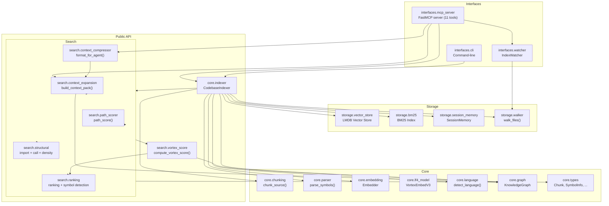
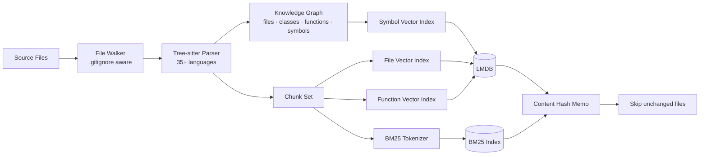
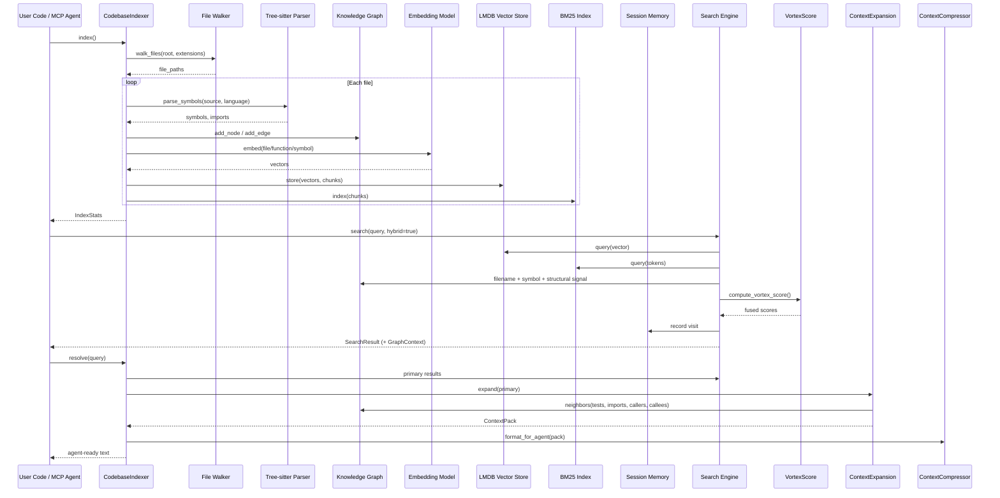

<div align="center">

# vortexa &nbsp; 🧠

**V2 Context Engine — agent-first code retrieval**

_Knowledge graph · hybrid search · context expansion · MCP server · AST-aware chunking_

[](LICENSE)
[](https://www.python.org)
[](https://pypi.org/project/vortexa/)
[](https://pypi.org/project/vortexa/)

</div>

> Ask your codebase questions instead of grepping it. vortexa turns a repository
> into a persistent, agent-first **context engine**: semantic + keyword hybrid
> search over a multi-level vector index, a structural knowledge graph, automatic
> context expansion, and a weighted **Vortex Score** — all exposed through a Python
> API, a CLI, and an MCP server.

---

## Table of Contents

- [Overview](#overview)
- [Features](#features)
- [Installation](#installation)
- [Quick Start](#quick-start)
  - [Index a codebase](#index-a-codebase)
  - [Search in natural language](#search-in-natural-language)
  - [Resolve full context (for agents)](#resolve-full-context-for-agents)
- [Documentation](#documentation)
- [Python API](#python-api)
  - [Indexing](#indexing)
  - [Searching](#searching)
  - [Knowledge graph & context expansion](#knowledge-graph--context-expansion)
  - [Watch mode](#watch-mode)
  - [Management](#management)
- [CLI](#cli)
- [MCP Server](#mcp-server)
- [Architecture](#architecture)
- [Dependencies](#dependencies)
- [License](#license)

---

<div align="center">

## Overview

</div>

vortexa is an **agent-first codebase context engine**. On top of a hybrid
dense (semantic) + sparse (BM25) index, it builds:

- a **knowledge graph** of files, classes, functions, methods, and symbols with
  `import` / `call` / `containment` edges;
- a **multi-level vector index** at file, function, and symbol granularity;
- **context expansion** that pulls in tests, importers, callers, callees, and
  sibling modules;
- a weighted **Vortex Score** that fuses semantic similarity, BM25, filename
  signals, graph signals, and structural importance into a single ranking;
- a **session memory** that tracks agent queries and visited symbols across MCP
  turns.

The result is that a single call hands an agent a complete `ContextPack` —
primary results *plus* the surrounding code an LLM needs to actually answer the
question — instead of a flat list of `file:line` hits.

```python
results = indexer.search("authentication middleware that validates JWT tokens", top_k=5)
# → Finds the right files even if they use "auth", "verify", "token" instead of "authentication"

pack = indexer.resolve("where is JWT validation implemented?", top_k=5)
# → Primary results + tests + importers + callees + graph expansion, formatted for an agent
```

vortexa runs as a **standalone Python library**, can be embedded into any agent,
or serves as an **MCP server** for LLM tools.

---

<div align="center">

## Features

</div>

| Capability | What it gives you |
|------------|-------------------|
| **Semantic search** | Find code by describing what it does in natural language — no exact-string matching required. |
| **Hybrid retrieval** | Combines dense embeddings (meaning) with BM25 (keyword precision) using adaptive alpha weighting. |
| **Knowledge graph** | Per-repo graph of files, classes, functions, methods, and symbols with import / call / containment edges. Traverse, query by seed, or compute shortest paths. |
| **Context expansion** | Given primary results, automatically expands to include tests, importers, callers, callees, and sibling modules — packaged as a structured `ContextPack`. |
| **Vortex Score** | Weighted fusion of semantic similarity, BM25, filename / path signal, symbol signal, graph proximity, import signal, and structural importance. |
| **Multi-level indexing** | Three separate vector indexes — file, function, symbol — for granular lookup, each backed by LMDB. |
| **AST-aware chunking** | Splits source at function/class/block boundaries using tree-sitter when available, with line-based fallback. Supports 100+ file extensions across 35+ languages. |
| **Incremental indexing** | Content-hash memoization means only changed files are re-embedded; full re-index avoids redundant work. |
| **Persistent storage** | LMDB-backed vector store, BM25 index, knowledge graph, and session memory survive restarts. |
| **Session memory** | Tracks agent queries, visited symbols, and recent result files across MCP turns to boost recall of recently-touched code. |
| **Live watch mode** | Background thread (native `inotify`/`FSEvents` via `watchfiles`, or polling fallback) auto-re-indexes with debounce. |
| **MCP server** | 11 tools across search, graph, and lifecycle — pluggable into Claude Code, Cursor, and any MCP-compatible agent. |
| **Zero mandatory heavy deps** | Core needs only `numpy`, `lmdb`, `bm25s`, `pathspec`, `huggingface-hub`, `tokenizers`, `safetensors`, and `fastmcp`. Model2Vec / SentenceTransformers / tree-sitter are optional extras. |

---

<div align="center">

## Installation

</div>

The MCP server and the default `VTXAI/Vortex-Embed-4.7M` embedding model are
included in the base install, so the library, CLI, and `vortexa serve` work out
of the box with no extra dependencies.

```bash
# Core: hybrid search + LF4 embeddings + line-based chunking + MCP server
pip install vortexa

# Full: adds Model2Vec + SentenceTransformers + tree-sitter AST chunking
pip install "vortexa[full]"

# Everything (alias for the full feature set)
pip install "vortexa[full]"
```

Optional extras:

```bash
pip install "vortexa[full]"    # model2vec + sentence-transformers + tree-sitter-language-pack
```

> **Note:** `fastmcp` is a *required* dependency of the base package, so the MCP
> server is always available — `vortexa[mcp]` is retained for backwards
> compatibility but is equivalent to the base install.

---

<div align="center">

## Quick Start

</div>

### Index a codebase

```python
from vortexa.core.indexer import CodebaseIndexer

indexer = CodebaseIndexer(root=".")
stats = indexer.index()

print(f"Indexed {stats.indexed_files} files, {stats.total_chunks} chunks")
print(f"Graph: {indexer.graph.node_count} nodes, {indexer.graph.edge_count} edges")
print(f"Languages detected: {stats.languages}")
print(f"Index time: {stats.index_time_ms:.0f} ms")
```

### Search in natural language

```python
results = indexer.search("CSV parser implementation", top_k=5)

for r in results:
    print(f"{r.chunk.file_path}:{r.chunk.start_line}  score={r.score:.3f}")
    print(f"  {r.chunk.content[:150].strip()}")
    print()
```

```text
src/parsers/csv_parser.py:42  score=0.892
  def parse_csv(filepath: str, delimiter: str = ",") -> list[dict]:
      """Parse a CSV file into a list of dictionaries."""
      with open(filepath, "r") as f:

tests/test_csv_parser.py:15  score=0.756
  def test_parse_csv_with_header():
      result = parse_csv("test.csv")
      assert len(result) == 3
```

### Resolve full context (for agents)

```python
pack = indexer.resolve("how are JWT tokens validated?", top_k=5)
print(indexer.format_context(pack))
# pack.primary_chunks  — top-scoring chunks
# pack.test_files      — test files for the primary results
# pack.imports         — modules imported by primary results
# pack.imported_by     — modules that import the primary results
# pack.callers         — callers of the primary symbols
# pack.callees         — callees of the primary symbols
# pack.symbols         — symbol definitions
# pack.dependency_chain— dependency chain
```

---

<div align="center">

## Documentation

</div>

Detailed, in-depth documentation lives in the [`docs/`](docs/) directory:

- [Getting Started](docs/getting-started.md) — install, quick start, configuration, project layout
- [Architecture](docs/architecture.md) — data flow, module layout, indexing pipeline, persistence
- [Python API Reference](docs/python-api.md) — `CodebaseIndexer`, types, and the public surface
- [CLI Reference](docs/cli.md) — `search`, `resolve`, `explain`, `serve`, and the legacy `-q` mode
- [MCP Server](docs/mcp-server.md) — the 11 tools and integration with Claude Code / Cursor
- [Knowledge Graph & Scoring](docs/knowledge-graph.md) — graph model, context expansion, Vortex Score, session memory
- [Embedding Models](docs/embeddings.md) — the default LF4 model and how to swap embedders
- [Contributing](docs/contributing.md) — development setup, tests, and conventions

---

<div align="center">

## Python API

</div>

### Indexing

```python
from vortexa.core.indexer import CodebaseIndexer
from vortexa.core.types import ChunkConfig

# Default chunking (target ~1500 characters per chunk, 200-char overlap)
indexer = CodebaseIndexer(root="/path/to/project")
stats = indexer.index()
# → IndexStats(indexed_files=127, total_chunks=843, languages={"python": 45, ...})

# Custom chunk configuration (size/overlap are measured in characters)
indexer = CodebaseIndexer(
    root=".",
    chunk_config=ChunkConfig(chunk_size=2000, chunk_overlap=300),
)
stats = indexer.index(force=False, include_text_files=True)

# Force a full re-index
stats = indexer.index(force=True)
```

After indexing, `indexer.graph` holds the knowledge graph and `indexer.session`
tracks query history.

### Searching

```python
# Hybrid search (auto-weighted semantic + BM25)
results = indexer.search("error handling", top_k=10)

# Pure semantic search
results = indexer.search("database connection pool", top_k=5, alpha=1.0)

# Pure BM25 keyword search
results = indexer.search("parse csv", top_k=5, alpha=0.0)

# Hybrid search with per-file graph context (key symbol + 1 in + 1 out edge)
results = indexer.search("auth middleware", top_k=5, hybrid=True)

# Symbol lookup (find definitions by name)
results = indexer.find_symbol("ConnectionPool", top_k=5)

# Related chunks (find chunks similar to a given chunk index)
results = indexer.find_related(chunk_idx=3, top_k=5)
```

Each result is a `SearchResult` (or a `SearchResultWithContext` when
`hybrid=True`):

| Field | Type | Description |
|-------|------|-------------|
| `chunk.file_path` | `str` | Relative file path |
| `chunk.start_line` | `int` | Start line number |
| `chunk.end_line` | `int` | End line number |
| `chunk.content` | `str` | Code snippet (up to 500 chars) |
| `chunk.language` | `str` | Detected programming language |
| `chunk.chunk_hash` | `str` | Content hash for memoization |
| `score` | `float` | Final vortex score (0–1) |
| `source` | `SearchMode` | `semantic`, `bm25`, `hybrid`, or `symbol` |
| `context` | `GraphContext?` | Present when `hybrid=True`; key symbol + 1 incoming + 1 outgoing edge |

### Knowledge graph & context expansion

```python
# Inspect the graph
print(indexer.graph.node_count, "nodes,", indexer.graph.edge_count, "edges")

# Most-connected architectural hubs (excludes file-level hub nodes)
hubs = indexer.get_god_nodes(top_n=10)
for h in hubs:
    print(h["label"], h["kind"], h["degree"])

# Find a node by name
nodes = indexer.graph.find_nodes_by_name("JWTValidator")
for n in nodes:
    print(n.id, n.kind, n.file_path)

# Outgoing / incoming edges
edges = indexer.graph.get_neighbors("class:JWTValidator")

# Shortest path between two nodes (matched by label)
path = indexer.get_shortest_path("file:src/auth/jwt.py", "file:src/api/users.py")
```

For agent-style retrieval, use `resolve` to get a fully assembled `ContextPack`:

```python
pack = indexer.resolve("how are JWT tokens validated?", top_k=5)
print(indexer.format_context(pack))
```

The MCP `resolve` tool returns the same `ContextPack` as JSON, and the MCP
`search` tool can attach per-file `graph_context` to each result via
`hybrid=true`.

### Watch mode

```python
from vortexa.interfaces.watcher import IndexWatcher

watcher = IndexWatcher(indexer, poll_interval=3.0)
watcher.start()   # Background thread; auto-re-indexes when files change
# ... files change on disk, auto-re-index happens ...
watcher.stop()
```

The watcher prefers `watchfiles` (native `inotify`/`FSEvents`/`ReadDirectoryChangesW`)
and falls back to `(mtime_ns, size)` polling if unavailable. Set `force_polling=True`
to always poll, or set `VORTEXA_FORCE_POLLING=1` in the environment.

### Management

```python
# Index statistics (includes graph + session info)
stats = indexer.stats()
# → {indexed_files, total_chunks, languages, graph_nodes, graph_edges,
#    memo_hits, memo_misses, session_queries}

# Reset
indexer.clear()   # Delete the persistent index + graph + session
```

---

<div align="center">

## CLI

</div>

The `vortexa` command exposes subcommands and a backward-compatible `-q` alias:

```bash
# Search (with Vortex Score reranking) — JSON by default, --plain for text
vortexa search "authentication middleware that validates JWT tokens" --top-k 5 --plain

# Full context resolution with graph expansion
vortexa resolve "CSV parser implementation" --top-k 5

# Deep-dive into a file path, file:line, or symbol name
vortexa explain "src/auth/jwt.py:42"

# Start the MCP server (also the default when no arguments are given)
vortexa serve
# or: vortexa-serve

# Legacy alias (search without full Vortex Score rerank)
vortexa -q "authentication middleware that validates JWT tokens"
```

| Subcommand | Description |
|------------|-------------|
| `serve` | Start the MCP server on stdio (default with no args). |
| `search QUERY` | Hybrid semantic+BM25 search with Vortex Score reranking. |
| `resolve QUERY` | Full context resolution with knowledge-graph expansion. |
| `explain LOCATION` | Deep-dive into a file path, `file:line`, or symbol name. |
| `-q QUERY` | Legacy search shortcut (backward compatible). |

Common flags (all subcommands): `--root`, `--top-k`, `--alpha`, `--include-text`,
`--force`, `--no-index`, `--plain`. `search` additionally accepts `--hybrid`.
See [docs/cli.md](docs/cli.md) for the full reference.

---

<div align="center">

## For Agents

</div>

Paste the block below into an agent system prompt so it uses vortexa instead of
`grep`/`rg`/manual file reads. `resolve` is the recommended default: it returns
the match plus its tests, importers, callers, callees, and dependency chain in
one call.

```text
## Codebase Search

Use vortexa (not grep/rg/file reads) to search code or understand a repo. It
indexes the current directory (or pass --root <dir>).

  vortexa resolve "<query>" --plain          # default: matches + tests + callers/callees + deps
  vortexa search "<query>" --hybrid --plain  # ranked hits + per-file graph context
  vortexa explain "<file>:<line>|<symbol>"   # deep dive into a known location

Install: pip install vortexa  (add [full] for tree-sitter AST chunking).
```

For native MCP tool integration (Claude Code / Cursor), see [MCP Server](#mcp-server).

---

<div align="center">

## MCP Server

</div>

vortexa ships with a built-in **MCP (Model Context Protocol) server** that exposes
the entire V2 context engine as agent-friendly tools. Start it with:

```bash
# Auto-indexes current directory, serves on stdio
python -m vortexa.interfaces.mcp_server

# Or via the installed entry point
vortexa serve
```

On startup it indexes the current working directory and prints stats to stderr:

```text
[vortexa] Indexing /path/to/project ...
[vortexa] Ready: 127 files, 843 chunks, 2104 graph nodes in 1820ms
[vortexa] Auto-reindex watcher started (polling every 3s)
```

### Tools

The server exposes **11 tools** across three groups.

**Core search & context (3):**

| Tool | Description | Key arguments |
|------|-------------|---------------|
| `search` | Hybrid semantic + BM25 search. Pass `hybrid=true` to enrich each result with per-file graph context. | `query` (str), `top_k` (int, default 10), `hybrid` (bool) |
| `resolve` | Full context assembly — primary results + tests + importers + callers + callees + compressed text. | `query` (str), `top_k` (int, default 5) |
| `explain` | Deep-dive into a specific file path, line number, or symbol name; returns surrounding context and graph neighbors. | `location` (str) |

**Knowledge graph (5):**

| Tool | Description | Key arguments |
|------|-------------|---------------|
| `query_graph` | BFS or DFS traversal from query-relevant seeds. | `question` (str), `mode` (`"bfs"` or `"dfs"`), `depth` (int) |
| `get_god_nodes` | Most-connected real entities (architectural hubs). | `top_n` (int, default 10) |
| `get_graph_node` | Detailed info for one node (label, kind, degree, source file). | `label` (str) |
| `get_graph_neighbors` | Incoming and outgoing edges of a node. | `label` (str) |
| `get_shortest_path` | BFS shortest path between two symbols/files. | `source` (str), `target` (str), `max_hops` (int, default 8) |

**Lifecycle (3):**

| Tool | Description | Key arguments |
|------|-------------|---------------|
| `stats` | Index + graph + session statistics. | _(none)_ |
| `watch` | Start/stop the auto-reindex watcher. | `action` (`"start"` or `"stop"`) |
| `clear_index` | Drop the persistent index for the project root. | _(none)_ |

### Usage with Claude Code / Cursor

Add to your MCP configuration file (`~/.cursor/mcp.json` or Claude Code's
`mcp_servers` config):

```json
{
  "mcpServers": {
    "vortexa": {
      "command": "python",
      "args": ["-m", "vortexa.interfaces.mcp_server"],
      "cwd": "/path/to/your/project"
    }
  }
}
```

The agent now has access to the full V2 context engine — `search`, `resolve`,
and `explain` for retrieval; `query_graph`, `get_god_nodes`, `get_graph_node`,
`get_graph_neighbors`, and `get_shortest_path` for navigation; and `stats`,
`watch`, `clear_index` for lifecycle. This is significantly more effective than
`grep` or `rg` for exploratory queries, because each `search` call can return
primary results, related tests, importers, callers, and callees in a single
round-trip.

---

<div align="center">

## Architecture

</div>

vortexa is organized into four layers: `core` (orchestration + graph + parsing +
embedding), `storage` (LMDB vector store, BM25, session memory, file walker),
`search` (hybrid retrieval, ranking, scoring, context expansion), and
`interfaces` (CLI, MCP server, watcher).



### Indexing pipeline



### Data flow



For a deep dive into each module, the graph model, persistence, and the indexing
pipeline, see [docs/architecture.md](docs/architecture.md).

---

<div align="center">

## Dependencies

</div>

| Package | Required | Used for |
|---------|----------|----------|
| `numpy` | Yes | Vector operations, embedding inference |
| `lmdb` | Yes | Persistent vector store, BM25 state, and knowledge graph |
| `bm25s` | Yes | Fast BM25 keyword index and persistence |
| `pathspec` | Yes | `.gitignore` pattern matching in the file walker |
| `huggingface-hub` | Yes | Loading `VTXAI/Vortex-Embed-4.7M` |
| `tokenizers` | Yes | HF tokenizer for the LF4 embedding model |
| `safetensors` | Yes | Safe tensor loading for 4-bit weights |
| `fastmcp` | Yes | MCP server for LLM tool integration |
| `model2vec` | Optional | Alternative static embeddings (`[full]`) |
| `sentence-transformers` | Optional | Transformer-based dense embeddings (`[full]`) |
| `tree-sitter-language-pack` | Optional | AST-aware chunking + multi-language symbol extraction (`[full]`) |
| `watchfiles` | Optional | Native FS-event watcher backend |

Install optional groups:

```bash
pip install "vortexa[full]"        # model2vec + sentence-transformers + tree-sitter
```

---

<div align="center">

## License

</div>

Released under the [Apache License 2.0](LICENSE).

```
Copyright 2025 VortexAI

Licensed under the Apache License, Version 2.0 (the "License");
you may not use this file except in compliance with the License.
You may obtain a copy of the License at

    http://www.apache.org/licenses/LICENSE-2.0

Unless required by applicable law or agreed to in writing, software
distributed under the License is distributed on an "AS IS" BASIS,
WITHOUT WARRANTIES OR CONDITIONS OF ANY KIND, either express or implied.
See the License for the specific language governing permissions and
limitations under the License.
```
