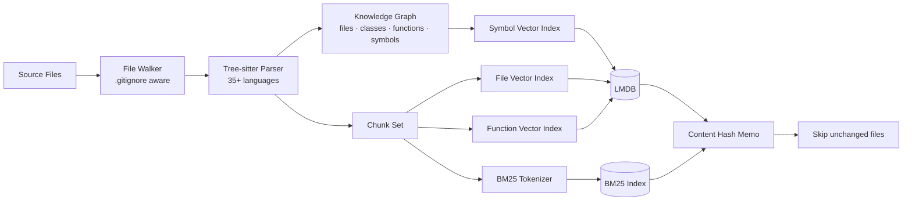
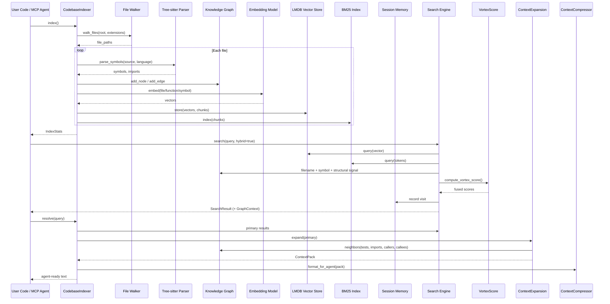

# Architecture

vortexa is a layered, dependency-light codebase context engine. This page
describes how the pieces fit together, the indexing pipeline, and persistence.

## Layers

```text
vortexa/
├── core/            # Orchestration + graph + parsing + embedding
│   ├── indexer.py       # CodebaseIndexer — main orchestrator
│   ├── chunking.py      # AST-aware (tree-sitter) + line-based chunking
│   ├── parser.py        # Multi-language tree-sitter symbol/import extraction
│   ├── embedding.py     # Embedder abstraction (LF4, Model2Vec, SentenceTransformers)
│   ├── lf4_model.py     # VortexEmbedV3 — default 4-bit LF4 embedder
│   ├── language.py      # Language detection & extension mapping
│   ├── graph.py         # KnowledgeGraph — nodes, edges, traversal, scoring
│   └── types.py         # Shared types (Chunk, ChunkConfig, IndexStats, ...)
├── storage/         # Persistence + filesystem
│   ├── vector_store.py  # LMDB-backed persistent vector store
│   ├── bm25.py          # BM25 keyword index with persistence
│   ├── session_memory.py# Per-session agent query / symbol visit tracking
│   └── walker.py        # Filesystem walker with .gitignore support
├── search/          # Retrieval + ranking + expansion
│   ├── search.py        # Hybrid search orchestrator (dense + sparse)
│   ├── ranking.py       # Result ranking & symbol-query detection
│   ├── path_scorer.py   # Filename / path signal scorer
│   ├── vortex_score.py  # Weighted fusion of all ranking signals
│   ├── structural.py    # Import-graph, call-graph, reference-density boosts
│   ├── context_expansion.py  # Pull tests, importers, callers, callees → ContextPack
│   ├── context_compressor.py # Token-budgeted formatting of a ContextPack
│   └── tokens.py        # Identifier tokenization (camelCase, snake_case)
└── interfaces/      # Entry points
    ├── cli.py           # Command-line search/resolve/explain/serve
    ├── mcp_server.py    # MCP server with 11 agent tools (stdio transport)
    └── watcher.py       # Live file watcher (watchfiles native + polling fallback)
```

## Design principles

- **Incremental & memoized.** Every chunk is content-hashed; unchanged files are
  skipped on re-index. The embedding model is loaded lazily and cached.
- **Persistent by default.** Everything lives in LMDB so an index survives
  restarts with no rebuild.
- **Agent-first output.** The unit of value is a `ContextPack`, not a list of
  `file:line` hits — primary results are expanded with the code an LLM needs.
- **No heavy servers.** No Postgres / vector DB / Redis. Just `numpy`, `lmdb`,
  and `bm25s`.

## Indexing pipeline



1. **Walk.** `storage.walker.walk_files` enumerates files, honoring `.gitignore`
   via `pathspec`, and skips files larger than 1 MB.
2. **Parse (V2).** `core.parser.parse_symbols` extracts symbols (classes,
   functions, methods, structs, enums, …) and imports from each file using
   tree-sitter when available, with a regex fallback.
3. **Chunk.** `core.chunking.chunk_source` splits source at AST boundaries
   (tree-sitter) or lines (fallback), respecting `ChunkConfig`.
4. **Embed.** `core.embedding.LF4Embedder` produces 256-dim vectors for each
   chunk, plus file-level, function-level, and symbol-level indexes.
5. **Graph.** `core.graph.build_graph_from_symbols` builds a knowledge graph:
   file nodes, symbol nodes, `CONTAINS` edges, and `IMPORTS` edges.
6. **Index.** Dense vectors go to LMDB vector stores; tokens go to the BM25
   index; memo hashes are recorded to skip unchanged files next time.
7. **Persist.** State, graph, multi-level indexes, session, and Vortex Score
   weights are written under `.jarvis/index`.

## Search pipeline



1. **Hybrid retrieval.** `search.search` runs dense (cosine over embeddings) and
   sparse (BM25) retrieval and combines them with an adaptive `alpha` weight
   (override with `alpha=`, `0.0` = pure BM25, `1.0` = pure semantic).
2. **Vortex Score (optional).** When `use_vortex_score=True`, results are
   re-ranked by `compute_vortex_score`, fusing eight normalized signals.
3. **Hybrid graph context.** When `hybrid=True`, each result is enriched with a
   `GraphContext` — the most query-relevant symbol in the file plus one incoming
   and one outgoing *structural* edge.
4. **Session memory.** The query and visited files are recorded.
5. **Resolve.** `resolve` runs the hybrid search, expands the primary results
   into a `ContextPack`, and compresses it to a token budget.

## Persistence

All state is stored under `<root>/.jarvis/index`:

- **`state.lmdb`** — chunk vectors (LMDB), BM25 state, file hashes, and the
  chunk memo (content-hash → chunk id).
- **`bm25/`** — persisted BM25 index.
- **`graph/graph.lmdb`** — knowledge graph: nodes, edges, and derived indexes
  (kind, name, file).
- **`file/`, `function/`, `symbol/`** — the three vector indexes, each with a
  `meta.json` of chunk metadata.
- **`session/`** — session memory (queries + visited symbols).
- **`vortex_weights.json`** — tunable Vortex Score weights (loaded on index).

Because everything is content-hashed and memoized, re-indexing a mostly-unchanged
repository is fast: only new or modified files are re-parsed and re-embedded.

## Concurrency & watching

- The **MCP server** auto-indexes the cwd on startup and starts an
  `IndexWatcher`. The watcher uses `watchfiles` for native FS events and falls
  back to `(mtime_ns, size)` polling. It can also be driven manually via the
  `watch` MCP tool or the `IndexWatcher` class.
- The default embedder (`VortexEmbedV3`) is loaded once and cached; embedding
  calls are thread-safe via a lock.

## Next steps

- See the [Python API Reference](python-api.md) for the `CodebaseIndexer` surface.
- Understand the [Knowledge Graph & Scoring](knowledge-graph.md).
- Explore the [Embedding Models](embeddings.md) for swapping the default model.
